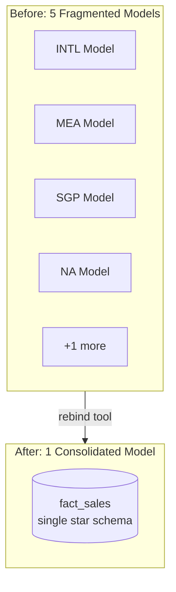
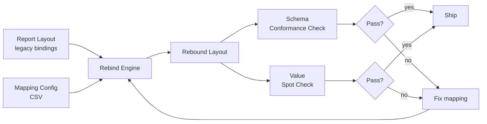

<!--
  Once both repos are pushed to GitHub, replace plain-text references to
  "enterprise-lakehouse-platform" with a direct link to that repo.
-->

# Fabric Migration Accelerator

A programmatic rebind framework for migrating Power BI report visuals from
fragmented, per-region semantic models onto a single consolidated model --
plus the data quality checks and cost reasoning that go with running a
migration like this for real, not just running the script once and hoping.

## Context

This repository generalizes a migration where 4 enterprise reports were
moved onto a unified Microsoft Fabric medallion lakehouse, consolidating 5
fragmented regional semantic models (INTL, MEA, SGP, NA, and one
additional region) into a single governed star schema. The manual
approach to rebinding the affected visuals -- 1,000+ visuals across 80+
report pages -- was estimated at roughly 3 weeks of dedicated engineering
time done by hand in Power BI Desktop. The framework here automates that
into minutes and makes it repeatable for every future schema change.

Client names, real schemas, and proprietary report content have been
removed. This illustrates the rebind *pattern* using a JSON structure
that mirrors the shape of a real Power BI Report/Layout definition's
field-binding sections, not a parser for the actual .pbix binary format
-- see [`rebind/README.md`](rebind/README.md) for why, and what a
production version would do differently.

## Before / after



## How the rebind and validation flow fits together



The rebind engine trusts the mapping file and applies it faithfully. The
two checks downstream trust nothing -- they independently verify the
mapping actually produced a correct result, which is the only way to
catch a stale or wrong mapping rather than just applying it consistently.
See [`data_quality/framework.md`](data_quality/framework.md) for why this
is two separate checks, not one, and what they actually caught when run
against this repo's own sample data.

## What this demonstrates

- **Bulk, programmatic rebinding** of structured field references across
  many visual definitions, with unmapped fields explicitly flagged rather
  than silently skipped or guessed at -- [`rebind/rebind_visuals.py`](rebind/rebind_visuals.py)
- **Independent schema conformance checking** that catches a stale
  mapping before it ships, not after a visual breaks in production --
  [`data_quality/schema_conformance_check.py`](data_quality/schema_conformance_check.py)
- **Value-level validation**, because a binding can resolve cleanly and
  still produce a wrong number -- [`data_quality/value_spot_check.py`](data_quality/value_spot_check.py)
- **Quantified cost reasoning** for both the migration itself and the
  lakehouse it migrates into -- [`finops/`](finops/)

## Repository structure

```
fabric-migration-accelerator/
├── README.md
├── rebind/
│   ├── README.md
│   ├── sample_report_layout.json   # synthetic, structurally-representative visual bindings
│   ├── mapping_config.csv          # legacy (table, field) -> canonical (table, field)
│   └── rebind_visuals.py           # the rebind engine (runnable)
├── data_quality/
│   ├── framework.md                # what "migrated correctly" means
│   ├── schema_conformance_check.py # runnable
│   ├── value_spot_check.py         # runnable
│   ├── sample_legacy_regional_revenue.csv
│   └── sample_consolidated_revenue.csv
├── finops/
│   ├── migration_cost_delta.md     # manual vs automated, quantified
│   └── lakehouse_cost_reasoning.md # storage tiering & Z-ordering as cost decisions
└── sample_data/
    └── canonical_schema.json       # the target schema bindings are checked against
```

## Running it end to end

```bash
cd rebind
python rebind_visuals.py
cd ../data_quality
python schema_conformance_check.py
python value_spot_check.py
```

No external dependencies -- everything here uses only the Python
standard library. See [`rebind/README.md`](rebind/README.md) for what
each step actually does and what output to expect, including a
deliberate mapping issue the conformance check is built to catch.
